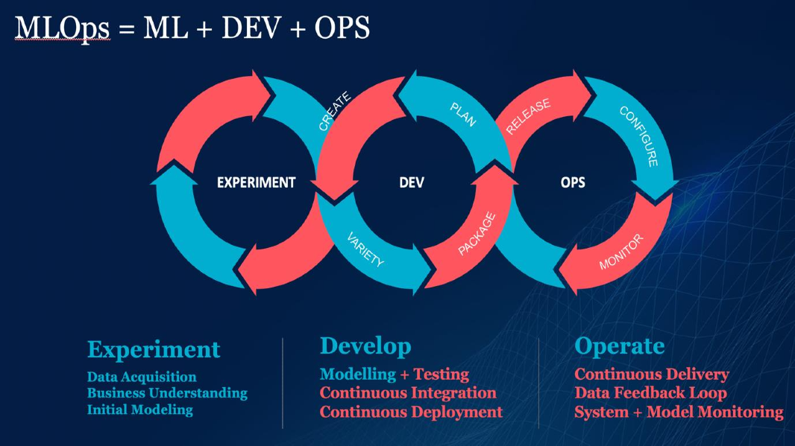

# Machine Learning In Production

A Learning Journal on Machine Learning in Production  

## Courses
- [**Full Stack Deep Learning 2022**](./full-stack-deep-learning/)
- [**Machine Learning Engineering for Production (MLOps) Specialization - Coursera (DeepLearning.AI)**](./ml-engineering-for-production-cousera/)  
- [**Docker & Kubernetes: The Practical Guide - Udemy**](./docker-kubernetes-practical-guide/)

## Projects

## Competition