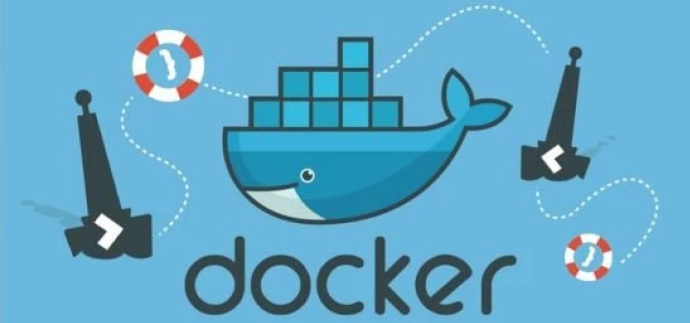
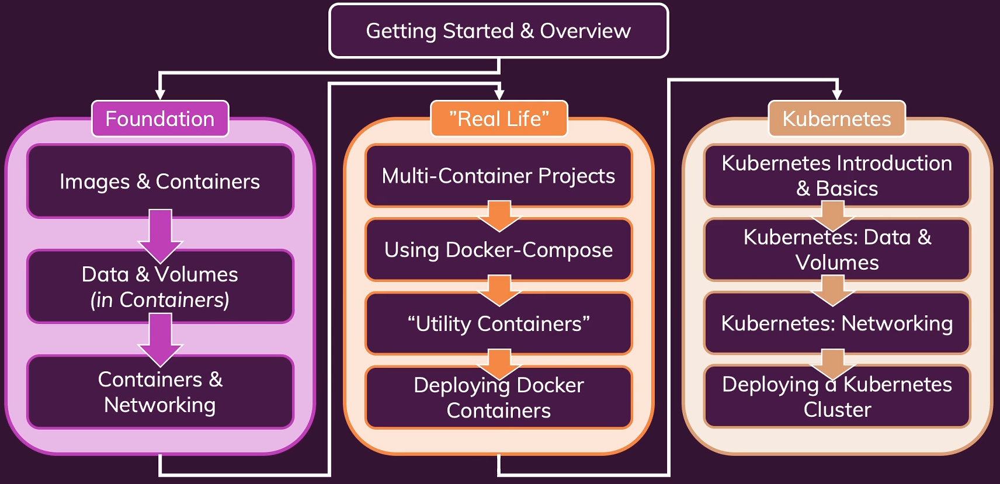

# Docker & Kubernetes: The Practical Guide - Udemy

Repo for the course [Docker & Kubernetes: The Practical Guide - Udemy](https://www.udemy.com/course/docker-kubernetes-the-practical-guide/).

## About this course

## Projects
1. [**Deploy a simple web app that prints out `Hi there!` using Docker**](./1.hi-there/)
2.1. 