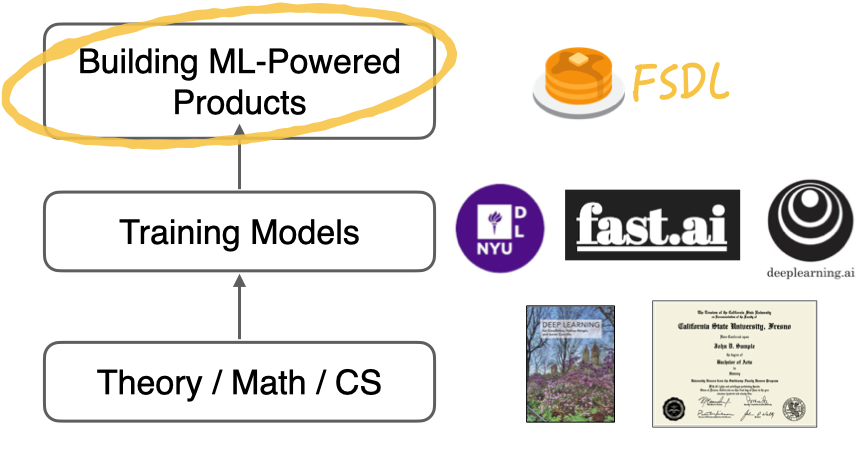

# Full Stack Deep Learning 2022

Welcome to my repo for the course [Full Stack Deep Learning (2022)](https://fullstackdeeplearning.com/course/). Here you will find my course notes, labs and the course project.

## Course Overview
There are many great courses on training deep learning models, but it is only one part of the deep learning stack. This course focuses on the other part of the stack, which is building and shipping ML-powered products.

### [Course Notes](https://khoaguin.notion.site/Full-Stack-Deep-Learning-2022-UC-Berkeley-8c2b19cf721e453b86a3e20fd209c7c3)

## Labs

## Project

## Resources
- https://github.com/full-stack-deep-learning/fsdl-text-recognizer-2022-labs
- 
