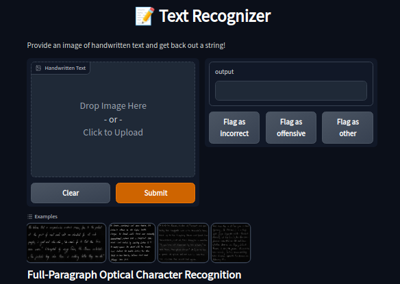
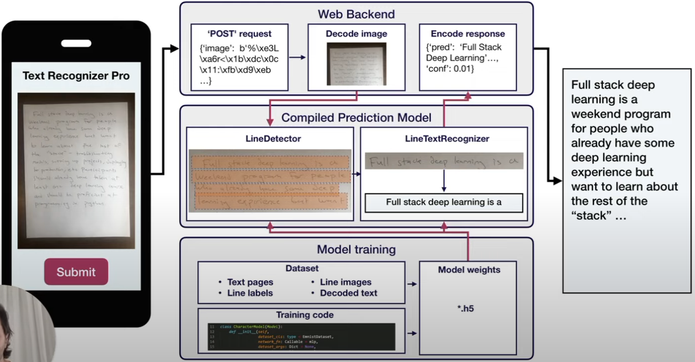
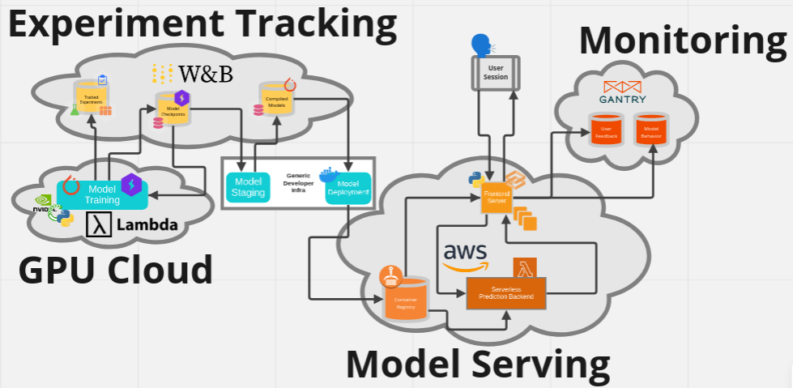

# Full Stack Deep Learning 2022
Welcome to my repo for the course [Full Stack Deep Learning (2022)](https://fullstackdeeplearning.com/course/). Here you will find my course notes, labs and the course project.

## Course Overview

There are many great courses on training deep learning models, but it is only one part of the deep learning stack. This course focuses on the other part of the stack, which is building and shipping ML-powered products.

### [Course Notes](https://khoaguin.notion.site/Full-Stack-Deep-Learning-2022-UC-Berkeley-8c2b19cf721e453b86a3e20fd209c7c3)

## Labs
  
As part of Full Stack Deep Learning 2022, we will incrementally develop a complete deep learning codebase through the labs to create and deploy a model that understands the content of hand-written paragraphs.

### [Lab 00: Overview](./labs/Lab00-Overview.ipynb) 
In the first lab, we go through the overview of the text recognizer app that demonstrates core principles and tools of an ML-powered application.

  
  

The diagram below shows the entire process and tools needed for training and running the text recognizer app. 

  

### [Lab 01: PyTorch](./labs/Lab01-PyTorch.ipynb)
At its core, [`PyTorch`](https://pytorch.org/) is a library for doing math on arrays with automatic calculation of gradients. It also makes it easy to accelerate computations with GPUs and distribute over computing nodes.  

In this lab, we will learn
- How to write a basic neural network from scratch in PyTorch
- How the submodules of `torch`, like `torch.nn` and `torch.utils.data`, make writing performant neural network training and inference code easier

### [Lab 02a: PyTorch Lightning](./labs/Lab02a-PyTorchLightning.ipynb)
[`PyTorch Lightning`](https://github.com/Lightning-AI/lightning) is a designed to organize PyTorch code in a more intuitive and easy-to-read way, making deep learning experiments easier to reproduce. It is also a useful tool to create scalable deep learning models that can easily run on distributed hardware while keeping the models hardware agnostic.

In this lab, we will learn:
- The core components of a PyTorch Lightning training loop: `LightningModules` and `Trainers`.
- Useful quality-of-life improvements offered by PyTorch Lightning: `LightningDataModules`, `Callbacks`, and `Metrics`
- How we use these features in the FSDL codebase

### [Lab 02b: Training a CNN on Synthetic Handwriting Data]()
In this lab, we will learn
- Fundamental principles for building neural networks with convolutional components
- How to use Lightning's training framework via a CLI

## Project

## Resources
- https://github.com/full-stack-deep-learning/fsdl-text-recognizer-2022-labs