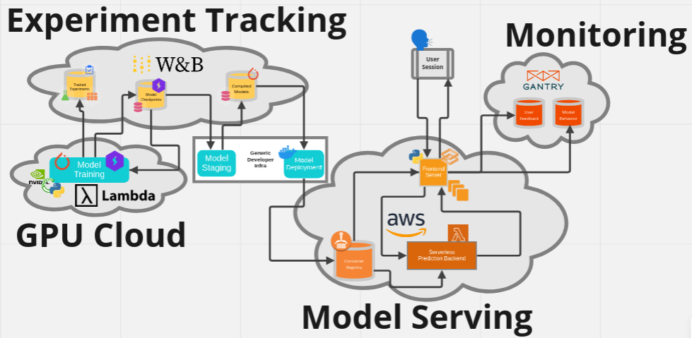

# Full Stack Deep Learning 2022 - Labs

  

As part of Full Stack Deep Learning 2022, we will incrementally develop a complete deep learning codebase through the labs to create and deploy a model that understands the content of hand-written paragraphs.

## Lab 00: Overview 
In the first lab, we go through the overview of the text recognizer app that demonstrates core principles and tools of an ML-powered application.

  

The diagram below shows the entire process and tools needed for training and running the text recognizer app. 

  

## Lab 01: PyTorch
At its core, [`PyTorch`](https://pytorch.org/) is a library for doing math on arrays with automatic calculation of gradients. It also makes it easy to accelerate computations with GPUs and distribute over computing nodes.  

In this lab, we will learn
- How to write a basic neural network from scratch in PyTorch
- How the submodules of `torch`, like `torch.nn` and `torch.utils.data`, make writing performant neural network training and inference code easier
