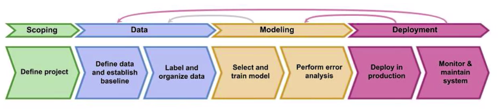
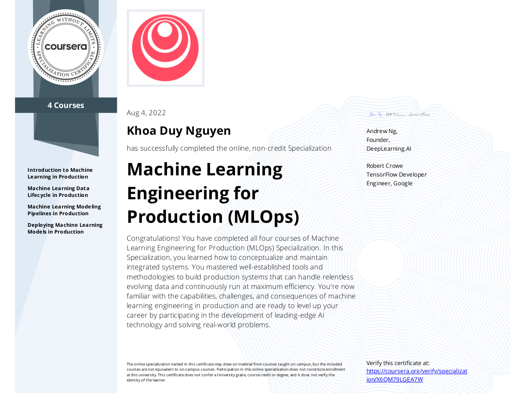

# Machine Learning Engineering for Production Specialization - Coursera

Welcome to my repo for the [DeepLearning.AI](https://www.deeplearning.ai/)'s [Machine Learning Engineering for Production Specialization](https://www.coursera.org/specializations/machine-learning-engineering-for-production-mlops?). Here you will find my notes, labs and assignments for the specialization. 

## About this Specialization

## Courses

## Notes
### [Link to Specialization Notes (in English)](https://khoaguin.notion.site/MLOps-Machine-Learning-Engineering-for-Production-Specialization-Coursera-7767e8d8d1504e31aefe31b4095a5052)

## Why this Specialization?

## Labs and Assignments

## Certification
