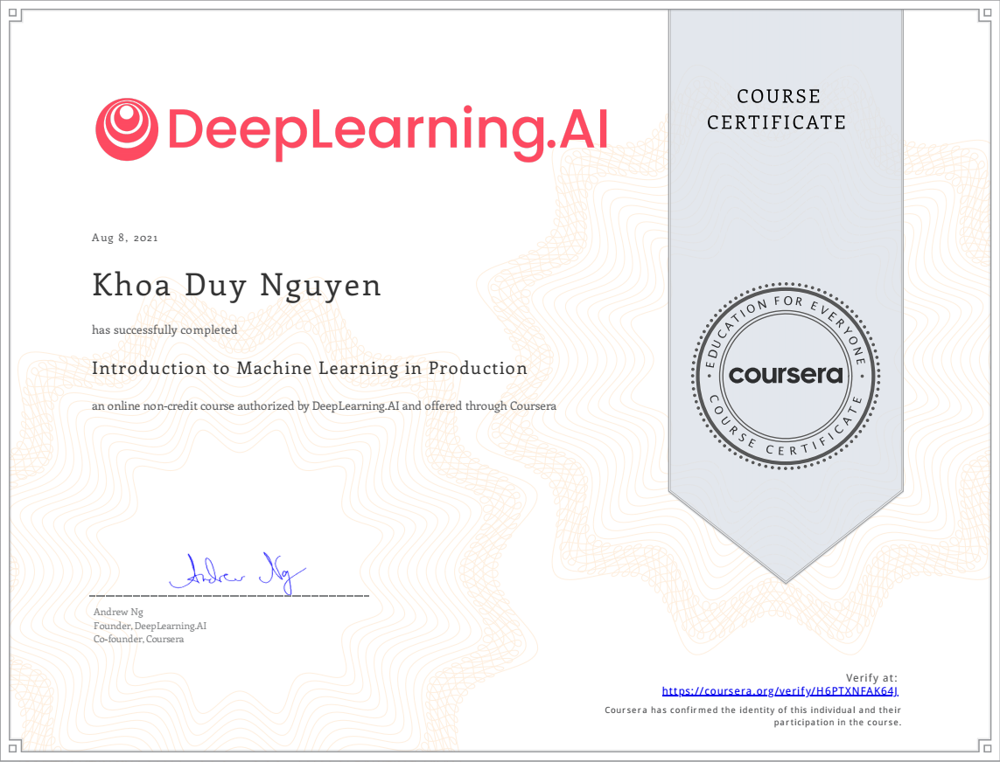

# Course 1 - Introduction to Machine Learning in Production

## Course Overview
In the first course of Machine Learning Engineering for Production Specialization, we will learn to identify the various components and design an ML production system end-to-end: project scoping, data needs, modeling strategies, and deployment constraints and requirements; and learn how to establish a model baseline, address concept drift, and prototype the process for developing, deploying, and continuously improving a productionized ML application.

## Certification
<!--  -->

