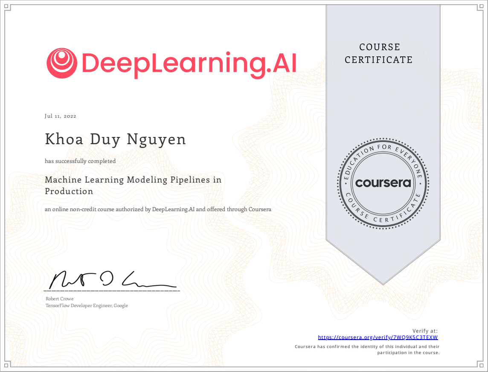

# Course 3 - Machine Learning Modeling Pipelines in Production

## Course Overview 
In the third course of Machine Learning Engineering for Production Specialization, we will build models for different serving environments; implement tools and techniques to effectively manage modeling resources and best serve offline and online inference requests. Furthermore, we will use analytics tools and performance metrics to address model fairness, explainability issues, and mitigate bottlenecks.

## Certification
<!--  -->