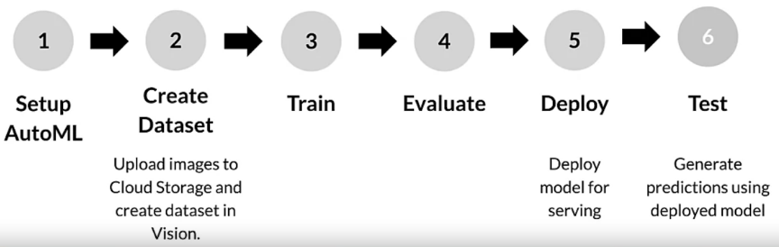

# Week 1 Assignment: Image Classification with AutoML on Google Cloud Platform
In this assignment, we will train and deploy a model using the Cloud AutoML API. More concretely, we will:
1. Upload a labeled dataset to Cloud Storage.
2. Connect the dataset to AutoML Vision with a CSV label file.
3. Train a model with AutoML Vision.
4. Evaluate the accuracy of the model.
5. Generate predictions on the trained model.

## Environment
We will use **Qwiklabs** - a real cloud environment that help developers learn cloud platforms and software. Qwiklabs shows the instructions needed to complete the assignment on the Google Cloud Platform, and it can also check the progress of the assignment. Check the file `ImageClassificationWithAutoMLVision-Qwiklabs.html`.