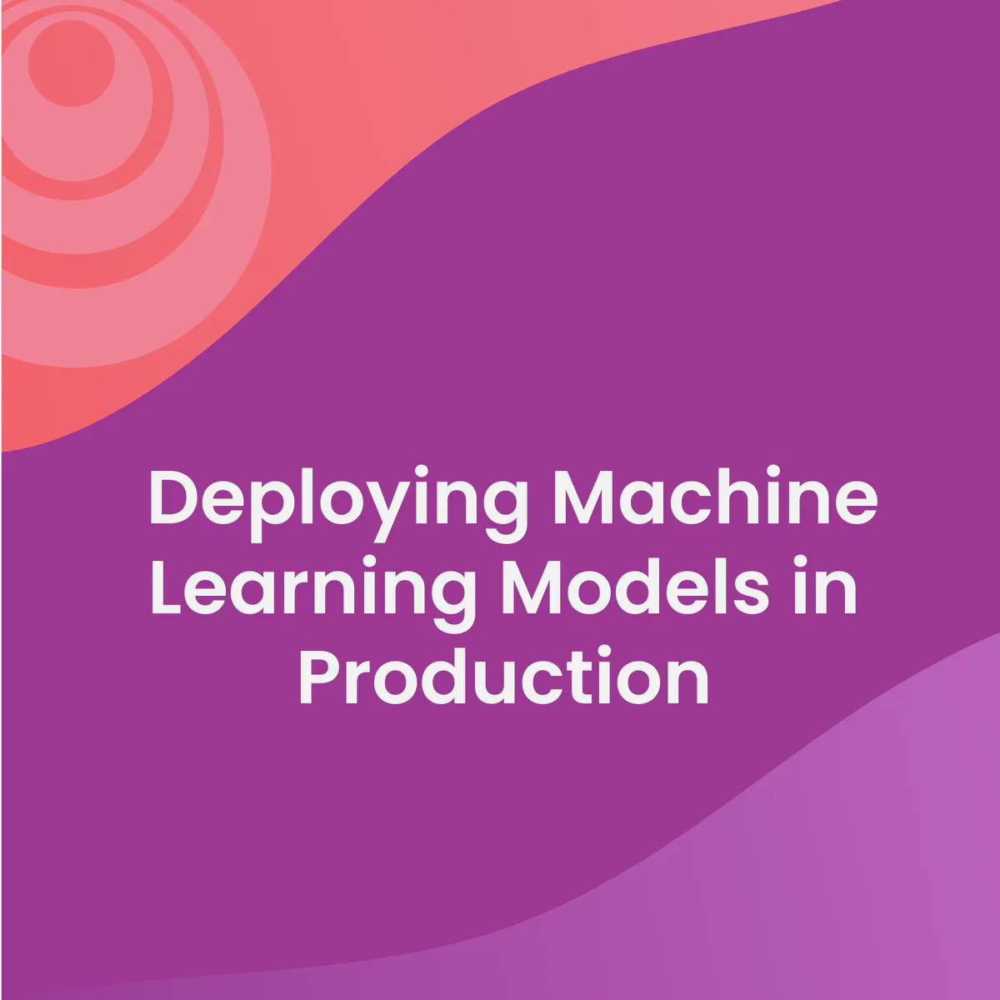
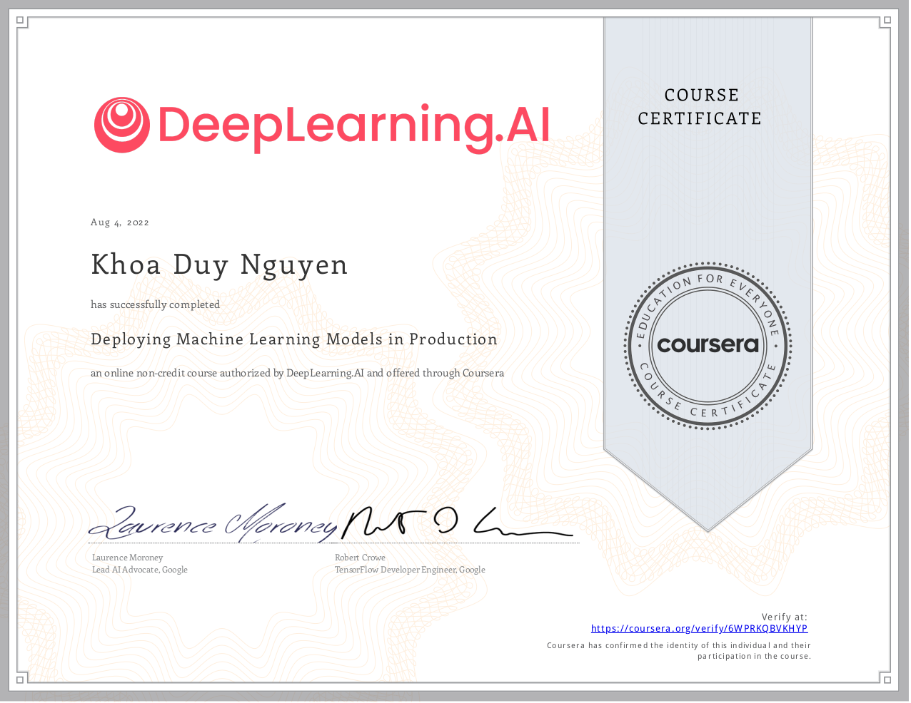

# Course 4 - Deploying Machine Learning Models in Production

## Course Overview 
In the fourth course of Machine Learning Engineering for Production Specialization, we will learn how to deploy ML models and make them available to end-users. We will build scalable and reliable hardware infrastructure to deliver inference requests both in real-time and batch depending on the use case. We will also implement workflow automation and progressive delivery that complies with current MLOps practices to keep the production system running. Additionally, we will continuously monitor the system to detect model decay, remediate performance drops, and avoid system failures so it can continuously operate at all times.  

## Certification
